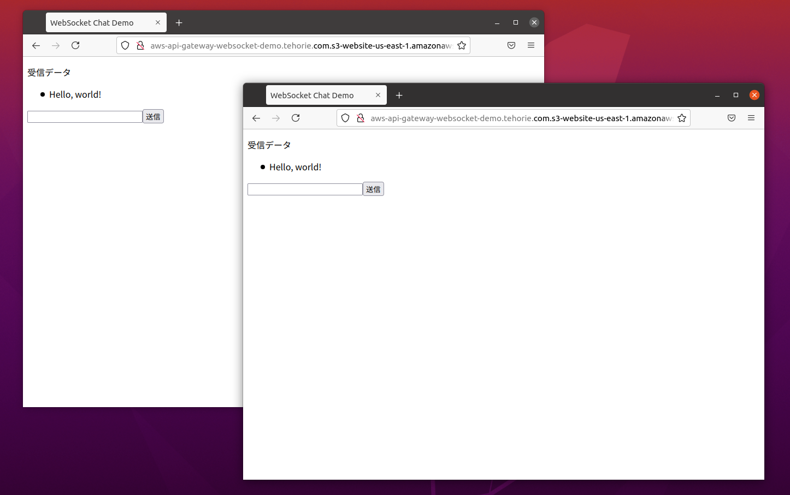
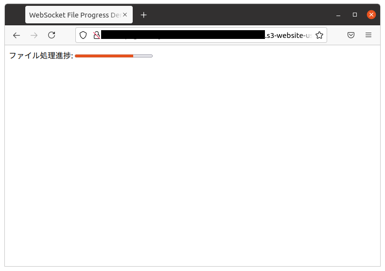
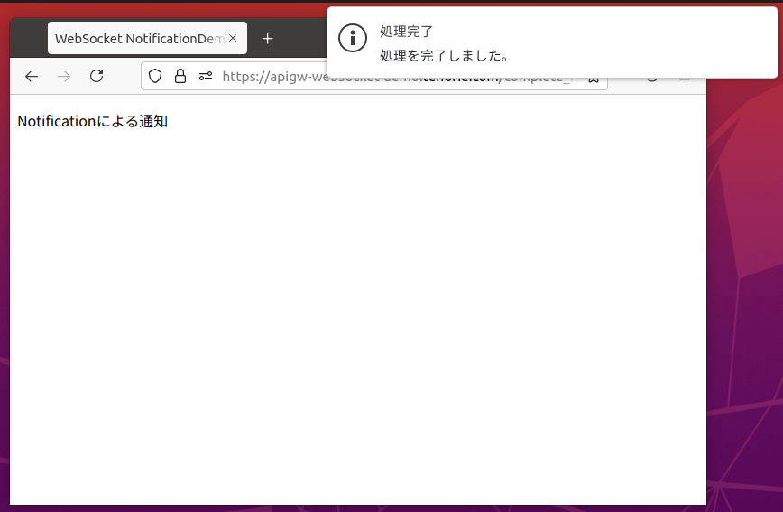
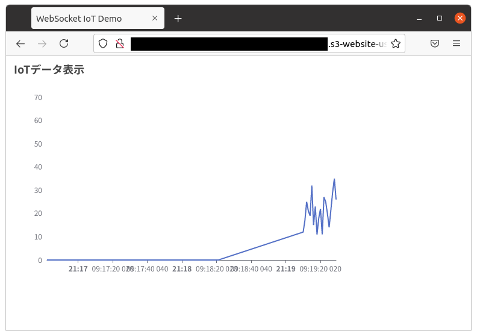

# aws-api-gateway-websocket-demo

AWS API GatewayでWebSocketを使うデモです

## 動作要件

以下がインストール・セットアップされている必要があります。

* Serverless Framework

## 使用方法

serverless.ymlファイルの以下の`xxxxx.example.com`をユニークな名前に書き換えます。

```yaml
    bucketName: xxxxx.example.com
```

### デプロイ

API Gateway、Lambda関数をデプロイします。

```bash
$ serverless deploy
(中略)
Serverless: Checking Stack update progress...
.....................
Serverless: Stack update finished...
Service Information
service: aws-api-gateway-websocket-demo
stage: dev
region: us-east-1
stack: aws-api-gateway-websocket-demo-dev
resources: 25
api keys:
  None
endpoints:
  wss://xxxxxxxxxx.execute-api.us-east-1.amazonaws.com/dev
functions:
  onConnect: aws-api-gateway-websocket-demo-dev-onConnect
  onDiscconect: aws-api-gateway-websocket-demo-dev-onDiscconect
  broadcast: aws-api-gateway-websocket-demo-dev-broadcast
layers:
  None
Serverless: Removing old service artifacts from S3...
```

上記の`wss://xxxxxxxxxx.execute-api.us-east-1.amazonaws.com/dev`の`xxxxxxxxxx`は変化します。この値で`client`ディレクトリのHTMLファイルの`WebSocket('wss://xxxxxxxxxx.execute-api.us-east-1.amazonaws.com/dev')`の`xxxxxxxxxx`を書き換えます。

書き換え後、HTMLファイルをS3にデプロイします。

```bash
$ serverless client deploy
(中略)
Serverless: Success! Your site should be available at http://xxxxx.example.com.s3-website-us-east-1.amazonaws.com/
```

デプロイしたindex.htmlファイルなどは、`http://xxxxx.example.com.s3-website-us-east-1.amazonaws.com/index.html`などでアクセスできます。

**ただし**、complete_notification.htmlはHTTPSプロトコルでアクセスしないと動作しないので、CloudFormationなどを使ってHTTPSアクセスできるようにしてください。

### APIの呼び出し

[wscat](https://github.com/websockets/wscat)を使ってテストしてみます。

wscatをインストールします。

```bash
npm install -g wscat
```

以下のコマンドを実行して、公開APIエンドポイントに接続します。(xxxxxxxxxxの部分はデプロイの結果の値にします)

```bash
$ wscat -c wss://xxxxxxxxxx.execute-api.us-east-1.amazonaws.com/dev
Connected (press CTRL+C to quit)
> {"action": "broadcast", "data": "Hello, world!"}
< Hello, world!
```

### チャット・アプリケーション

ブラウザで`http://xxxxx.example.com.s3-website-us-east-1.amazonaws.com/index.html`(URLのホスト名はデプロイの結果の値にします)にアクセスします。



### ファイルの処理の進捗表示

ブラウザで`http://xxxxx.example.com.s3-website-us-east-1.amazonaws.com/file_process.html`(URLのホスト名はデプロイの結果の値にします)にアクセスします。

アクセス直後は進捗が0%ですが、以下のようにwscatを使って進捗率を送信すると、進捗率が変化します。

```bash
$ wscat -c wss://xxxxxxxxxx.execute-api.us-east-1.amazonaws.com/dev
Connected (press CTRL+C to quit)
> {"action": "broadcast", "data": "75"}
< 75
```



### プッシュ通知

ブラウザで`https://xxxxx.example.co.jp/complete_notification.html`(URLのホスト名は、CloudFormationでのHTTPSアクセス用の値にします)にアクセスします。


以下のようにwscatを使って完了を送信すると、プッシュ通知のポップアップが表示されます。

```bash
$ wscat -c wss://xxxxxxxxxx.execute-api.us-east-1.amazonaws.com/dev
Connected (press CTRL+C to quit)
> {"action": "broadcast", "data": "complete"}
< complete
```



### IoTデータ表示

ブラウザで`http://xxxxx.example.com.s3-website-us-east-1.amazonaws.com/file_process.html`(URLのホスト名はデプロイの結果の値にします)にアクセスします。

以下のようにwscatを使って時刻とデータを送信すると、時系列のグラフが更新されます。

```bash
$ wscat -c wss://xxxxxxxxxx.execute-api.us-east-1.amazonaws.com/dev
Connected (press CTRL+C to quit)
> {"action": "broadcast", "data": "{\"name\": \"2021/06/24 21:09:10\", \"value\": [\"2021/06/24 21:09:10\", \"12\"]}"}
< {"name": "2021/06/24 21:09:10", "value": ["2021/06/24 21:09:10", "12"]}
```



