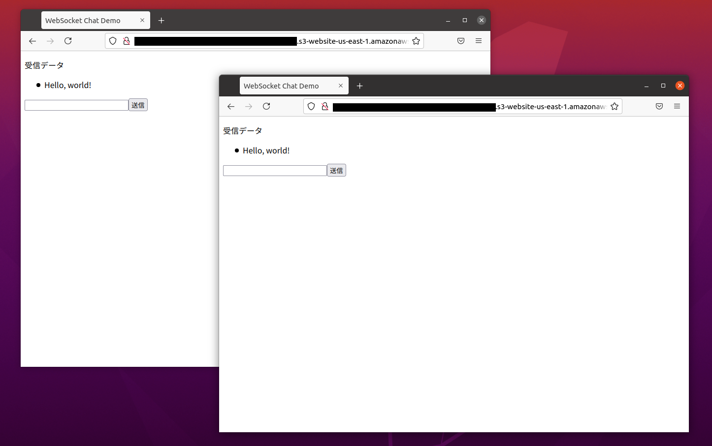

# aws-api-gateway-websocket-demo

AWS API GatewayでWebSocketを使うデモです

## 動作要件

以下がインストール・セットアップされている必要があります。

* Serverless Framework

## 使用方法

Serverless Finch プラグインをインストールします。

```bash
npm install --save serverless-finch
```

serverless.ymlファイルの以下の`xxxxx.example.com`をユニークな名前に書き換えます。

```yaml
    bucketName: xxxxx.example.com
```

### デプロイ

API Gateway、Lambda関数をデプロイします。

```bash
$ serverless deploy
(中略)
Serverless: Checking Stack update progress...
.....................
Serverless: Stack update finished...
Service Information
service: aws-api-gateway-websocket-demo
stage: dev
region: us-east-1
stack: aws-api-gateway-websocket-demo-dev
resources: 25
api keys:
  None
endpoints:
  wss://xxxxxxxxxx.execute-api.us-east-1.amazonaws.com/dev
functions:
  onConnect: aws-api-gateway-websocket-demo-dev-onConnect
  onDiscconect: aws-api-gateway-websocket-demo-dev-onDiscconect
  broadcast: aws-api-gateway-websocket-demo-dev-broadcast
layers:
  None
Serverless: Removing old service artifacts from S3...
```

上記の`wss://xxxxxxxxxx.execute-api.us-east-1.amazonaws.com/dev`の`xxxxxxxxxx`は変化します。この値で`client`ディレクトリのHTMLファイルの`WebSocket('wss://xxxxxxxxxx.execute-api.us-east-1.amazonaws.com/dev')`の`xxxxxxxxxx`を書き換えます。

書き換え後、HTMLファイルをS3にデプロイします。

```bash
$ serverless client deploy
(中略)
Serverless: Success! Your site should be available at http://xxxxx.example.com.s3-website-us-east-1.amazonaws.com/
```

デプロイしたindex.htmlファイルなどは、`http://xxxxx.example.com.s3-website-us-east-1.amazonaws.com/index.html`などでアクセスできます。

**ただし**、complete_notification.htmlはHTTPSプロトコルでアクセスしないと動作しないので、CloudFormationなどを使ってHTTPSアクセスできるようにしてください。

### APIの呼び出し

[wscat](https://github.com/websockets/wscat)を使ってテストしてみます。

wscatをインストールします。

```bash
npm install -g wscat
```

以下のコマンドを実行して、公開APIエンドポイントに接続します。(xxxxxxxxxxの部分はデプロイの結果の値にします)

```bash
$ wscat -c wss://xxxxxxxxxx.execute-api.us-east-1.amazonaws.com/dev
Connected (press CTRL+C to quit)
> {"action": "broadcast", "data": "Hello, world!"}
< Hello, world!
```

### チャット・アプリケーション

ブラウザで`http://xxxxx.example.com.s3-website-us-east-1.amazonaws.com/index.html`(URLのホスト名はデプロイの結果の値にします)にアクセスします。



### ファイルの処理の進捗表示

ブラウザで`http://xxxxx.example.com.s3-website-us-east-1.amazonaws.com/file_process.html`(URLのホスト名はデプロイの結果の値にします)にアクセスします。

アクセス直後は進捗が0%ですが、以下のようにwscatを使って進捗率を送信すると、進捗率が変化します。

```bash
$ wscat -c wss://xxxxxxxxxx.execute-api.us-east-1.amazonaws.com/dev
Connected (press CTRL+C to quit)
> {"action": "broadcast", "data": "75"}
< 75
```


### プッシュ通知

ブラウザで`https://xxxxx.example.co.jp/complete_notification.html`(URLのホスト名は、CloudFormationでのHTTPSアクセス用の値にします)にアクセスします。


以下のようにwscatを使って完了を送信すると、プッシュ通知のポップアップが表示されます。

```bash
$ wscat -c wss://xxxxxxxxxx.execute-api.us-east-1.amazonaws.com/dev
Connected (press CTRL+C to quit)
> {"action": "broadcast", "data": "complete"}
< complete
```


### HTTP POSTでのデータ送信

WebSocketでデータを送信するのではなくHTTPでPOSTして送信したい場合は、serverless.ymlファイルの以下の`xxxxxxxxxx`部分を、WebSocketのドメイン名に合わせて変更し、再デプロイします。

```yaml
  broadcast_post:
    handler: server/http_handler.broadcast_post
    environment:
      WS_DOMAIN: xxxxxxxxxx.execute-api.us-east-1.amazonaws.com
```

以下のようにcurlでデータをpostすると、他のクライアントでデータを受信できます。

```bash
$ curl -H "Accept: application/json" -H "Content-type: application/json" -X POST -d 'Hello, world!' https://xxxxxxxxxx.execute-api.us-east-1.amazonaws.com/dev/broadcast 
Data sent.
```

### IoTデータ表示

ブラウザで`http://xxxxx.example.com.s3-website-us-east-1.amazonaws.com/file_process.html`(URLのホスト名はデプロイの結果の値にします)にアクセスします。

以下のようにwscatを使ってデータを送信すると、時系列のグラフが更新されます。

```bash
$ wscat -c wss://xxxxxxxxxx.execute-api.us-east-1.amazonaws.com/dev
Connected (press CTRL+C to quit)
> {"action": "broadcast", "data": "12"}
< 12
```


### Wio Terminalの光センサーのデータを送信

#### 前提条件

[Seeed社のWio Terminalのネットワーク設定のページ](https://wiki.seeedstudio.com/Wio-Terminal-Network-Overview/)でWio Terminalのファームウェアをアップデートし、ライブラリをインストールします。

arduino/wio_terminal_light.inoファイルを開き、WiFiのSSIDとパスワードと、POST先のドメイン名を設定します。

```c++
const char* ssid = "your ssid";
const char* password =  "your ssid password";
const char* postUrl =  "https://xxxxxxxxxx.execute-api.us-east-1.amazonaws.com/dev/broadcast";
```

証明書が合わず、エラーになる場合は、以下のコマンドを実行して証明書の値を書き換えます。

```bash
 openssl s_client -showcerts -verify 5 -connect xxxxxxxxxx.execute-api.us-east-1.amazonaws.com:443 < /dev/null
```

```c++
const char* rootCa = \
                      "-----BEGIN CERTIFICATE-----\n"
                      "MIIEdTCCA12gAwIBAgIJAKcOSkw0grd/MA0GCSqGSIb3DQEBCwUAMGgxCzAJBgNV\n"
                      "BAYTAlVTMSUwIwYDVQQKExxTdGFyZmllbGQgVGVjaG5vbG9naWVzLCBJbmMuMTIw\n"
                      "MAYDVQQLEylTdGFyZmllbGQgQ2xhc3MgMiBDZXJ0aWZpY2F0aW9uIEF1dGhvcml0\n"
                      "eTAeFw0wOTA5MDIwMDAwMDBaFw0zNDA2MjgxNzM5MTZaMIGYMQswCQYDVQQGEwJV\n"
                      "UzEQMA4GA1UECBMHQXJpem9uYTETMBEGA1UEBxMKU2NvdHRzZGFsZTElMCMGA1UE\n"
                      "ChMcU3RhcmZpZWxkIFRlY2hub2xvZ2llcywgSW5jLjE7MDkGA1UEAxMyU3RhcmZp\n"
                      "ZWxkIFNlcnZpY2VzIFJvb3QgQ2VydGlmaWNhdGUgQXV0aG9yaXR5IC0gRzIwggEi\n"
                      "MA0GCSqGSIb3DQEBAQUAA4IBDwAwggEKAoIBAQDVDDrEKvlO4vW+GZdfjohTsR8/\n"
                      "y8+fIBNtKTrID30892t2OGPZNmCom15cAICyL1l/9of5JUOG52kbUpqQ4XHj2C0N\n"
                      "Tm/2yEnZtvMaVq4rtnQU68/7JuMauh2WLmo7WJSJR1b/JaCTcFOD2oR0FMNnngRo\n"
                      "Ot+OQFodSk7PQ5E751bWAHDLUu57fa4657wx+UX2wmDPE1kCK4DMNEffud6QZW0C\n"
                      "zyyRpqbn3oUYSXxmTqM6bam17jQuug0DuDPfR+uxa40l2ZvOgdFFRjKWcIfeAg5J\n"
                      "Q4W2bHO7ZOphQazJ1FTfhy/HIrImzJ9ZVGif/L4qL8RVHHVAYBeFAlU5i38FAgMB\n"
                      "AAGjgfAwge0wDwYDVR0TAQH/BAUwAwEB/zAOBgNVHQ8BAf8EBAMCAYYwHQYDVR0O\n"
                      "BBYEFJxfAN+qAdcwKziIorhtSpzyEZGDMB8GA1UdIwQYMBaAFL9ft9HO3R+G9FtV\n"
                      "rNzXEMIOqYjnME8GCCsGAQUFBwEBBEMwQTAcBggrBgEFBQcwAYYQaHR0cDovL28u\n"
                      "c3MyLnVzLzAhBggrBgEFBQcwAoYVaHR0cDovL3guc3MyLnVzL3guY2VyMCYGA1Ud\n"
                      "HwQfMB0wG6AZoBeGFWh0dHA6Ly9zLnNzMi51cy9yLmNybDARBgNVHSAECjAIMAYG\n"
                      "BFUdIAAwDQYJKoZIhvcNAQELBQADggEBACMd44pXyn3pF3lM8R5V/cxTbj5HD9/G\n"
                      "VfKyBDbtgB9TxF00KGu+x1X8Z+rLP3+QsjPNG1gQggL4+C/1E2DUBc7xgQjB3ad1\n"
                      "l08YuW3e95ORCLp+QCztweq7dp4zBncdDQh/U90bZKuCJ/Fp1U1ervShw3WnWEQt\n"
                      "8jxwmKy6abaVd38PMV4s/KCHOkdp8Hlf9BRUpJVeEXgSYCfOn8J3/yNTd126/+pZ\n"
                      "59vPr5KW7ySaNRB6nJHGDn2Z9j8Z3/VyVOEVqQdZe4O/Ui5GjLIAZHYcSNPYeehu\n"
                      "VsyuLAOQ1xk4meTKCRlb/weWsKh/NEnfVqn3sF/tM+2MR7cwA130A4w=\n"                      
                      "-----END CERTIFICATE-----\n";
```
